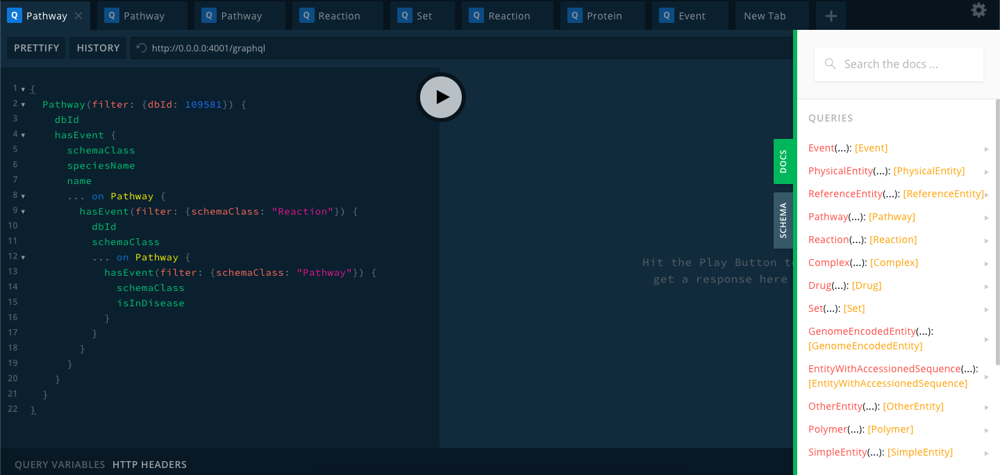
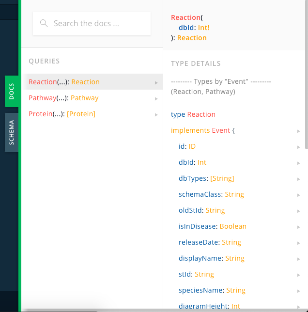
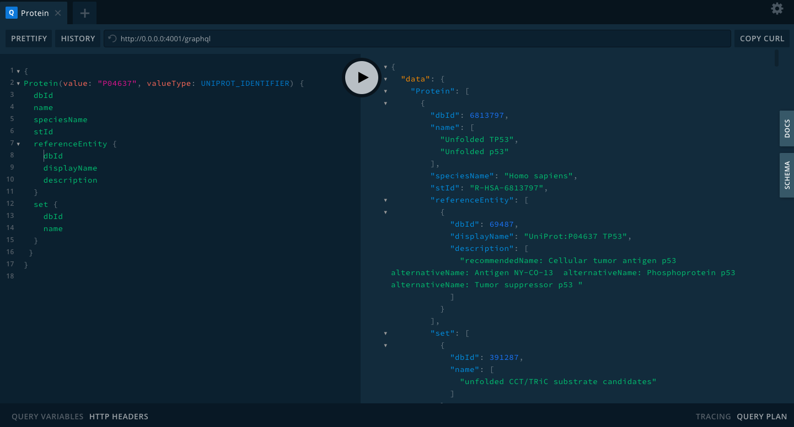
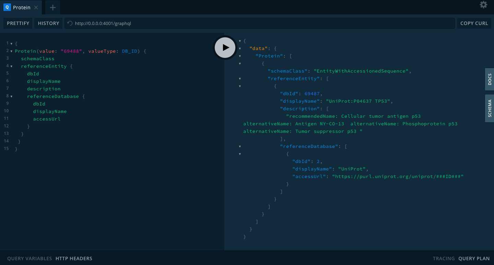
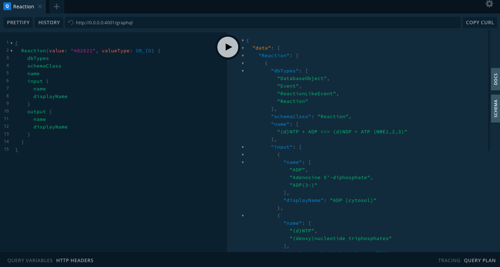

# GraphQL Interface For Querying Reactome Data

## PART - A: Project Setup

### 0. Install essentials
A. Install Docker (https://docs.docker.com/get-docker/) 

B. Install NodeJS (https://nodejs.org/en/download/)

### 1. Get Reactome's Neo4j database running 

A. Download Reactome's database: https://reactome.org/download/current/reactome.graphdb.tgz

B. Execute docker command:

```
docker run -p 7687:7687 -p 7474:7474 -e NEO4J_dbms_allow__upgrade=true -v $(pwd)/graph.db:/var/lib/neo4j/data/databases/graph.db neo4j:3.5.17
```

**Note:**

A. It is recommended to open the Neo4j database link in incognito mode to avoid cache problems

B. Default ```username = neo4j``` and ```password = neo4j```

C. Set and remember new password (which will be required in step 3)

### 2. Clone/Download project files and install dependencies

```
npm install
```

### 3. Configure credentials

Set your Neo4j connection string and credentials in `.env` file. For example:

**Note:** It is essential to change password value for the field **NEO4J_PASSWORD** to the new password value that was set in **1.C** (above).

```
NEO4J_URI=bolt://localhost:7687
NEO4J_USER=neo4j
NEO4J_PASSWORD=reactome
```

### 4. Start the GraphQL service

a. Development mode:

```
npm run start:dev
```

b. Production mode:

```
npm start
```

This will start the GraphQL service (http://0.0.0.0:4001/graphql) where you can issue GraphQL requests by accessing GraphQL Playground in the browser.




## PART - B: Project Details

### 0. Description:
Reactome currently uses a REST-based API that allows end-users to obtain specific data from a set of predefined end-points. To provide better flexibility and allow users to query whatever data they need, this project provides a GraphQL interface to Reactome data fetched from a Neo4j database.

### 1. Tools Used:
1. GraphQL (https://graphql.org/)
2. JavaScript (https://developer.mozilla.org/en-US/docs/Web/JavaScript)
3. NodeJS (https://nodejs.org/en/)
4. Neo4j Database (https://neo4j.com/)

### 2. GraphQL Entrypoints:
There are three entrypoints in GraphQL Playground to query data from the Neo4j database:
1. Reaction 
2. Pathway 
3. Protein 


### 3. Querying Entrypoints Using Arguments
Reaction, Pathway and, Protein classes can be queries using two arguments and they are: 
1. value
2. valueType

**Note:** For the best querying experience make extensive use of keyboard shortcuts **option + space**/**command + space** to get auto-suggestions in GraphQL Playground. 


Example GraphQL Queries:

**Reaction:**
```
{
  Reaction(value: "482621", valueType: DB_ID) {
    schemaClass
    name
    dbTypes
    releaseDate
    displayName
  }
}
```

**Pathway:**
```
{
  Pathway(value: "109581", valueType: DB_ID) {
    dbId
    isInDisease
    displayName
    stId
    speciesName
  }
}
```

**Protein:**
```
{
  Protein(value: "109581", valueType: DB_ID) {
    dbId
    isInDisease
    displayName
    stId
    speciesName
    systematicName
  }
}
```

### 4. Accessing non-entrypoint classes from within entrypoint classes
The non-entrypoint classes can be accessed by using sub-queries within entrypoint classes. The following are some examples:

**Case 1:** Accessing ```Reference Entity``` class from ```Protein``` class
```
{
  Protein(value: "109581", valueType: DB_ID) {
    dbId
    displayName
    stId
    speciesName
    referenceEntity {
      dbId
      dbTypes
      name
    }
  }
}
```

**Case 2:** Accessing ```Catalyst``` class from ```Reaction``` class
```
{
  Protein(value: "109581", valueType: DB_ID) {
    dbId
    displayName
    stId
    speciesName
    referenceEntity {
      dbId
      dbTypes
      name
    }
  }
}
```

**Case 3:** Accessing ```Physical Entity``` class from ```Reaction``` class
```
{
  Reaction(value: "482621", valueType: DB_ID) {
    dbTypes
    schemaClass
    name
    input {
      name
      displayName
    }
    output {
      name
      displayName
    }
  }
}
```


It is recommended to make extensive use of docs and/or schema panel in the right section of GraphQL Playground to learn more about which properties are permitted to query from a particular schema class type or sub-query.




### 5. Abstract and Concrete classes using Interfaces and Types respectively
The Reactome database is hierarchical in nature. The top-level classes are often abstract whereas lower-level classes are usually concrete. Thus, in GraphQL the abstract classes are defined as ```Interface``` and others as ```Type```.

**What is an Interface?** 

Like many type systems, GraphQL supports interfaces. An Interface is an abstract type that includes a certain set of fields that a type must include to implement the interface. 

(Learn more about Interface here -> https://graphql.org/learn/schema/#interfaces)

Currently, there are three main Interfaces in Reactome GraphQL schema and their corresponding Type sub-classes are as follows:

1. **PhysicalEntity** 
   - Complex
   - Drug
   - Set
   - GenomeEncodedEntity
   - EntityWithAccessionedSequence
   - OtherEntity
   - Polymer
   - SimpleEntity
   - Protein

2. **Event** 
   - Reaction
   - Pathway

3. **ReferenceEntity** 
   - ReferenceGeneProduct
   - ReferenceMolecule 


**Querying using GraphQL inline-fragments:**

What is GraphQL inline-fragments? and why is it used? 

An inline-fragment is used when an interface type is returned by a query which could be any kind of concrete object that implements the interface. To access fields that exist on a concrete type that implements an interface but doesn't exist on the interface itself, an inline-fragment is needed to tell GraphQL what to retrieve for a specific concrete type.

**Case 1:** Accessing ```hasEvent``` relation on ```Pathway``` class
```
{
  Pathway(value: "109581", valueType: DB_ID) {
    hasEvent {
      schemaClass
      speciesName
      name
      ... on Pathway {
        hasEvent {
          schemaClass
          speciesName
          name
        }
      }
    }
  }
}
```

**Case 2:** Accessing ```Members``` class on ```Set``` class
```
{
  Reaction(value: "482621", valueType: DB_ID) {
    dbTypes
    schemaClass
    stId
    input {
      name
      ... on Set {
        members {
          name
        }
      }
    }
  }
}
```

## PART - C: Sample GraphQL Query Output Examples

 
**Output**
```
{
  "data": {
    "Protein": [
      {
        "dbId": 6813797,
        "name": [
          "Unfolded TP53",
          "Unfolded p53"
        ],
        "speciesName": "Homo sapiens",
        "stId": "R-HSA-6813797",
        "referenceEntity": [
          {
            "dbId": 69487,
            "displayName": "UniProt:P04637 TP53",
            "description": [
              "recommendedName: Cellular tumor antigen p53  alternativeName: Antigen NY-CO-13  alternativeName: Phosphoprotein p53  alternativeName: Tumor suppressor p53 "
            ]
          }
        ],
        "set": [
          {
            "dbId": 391287,
            "name": [
              "unfolded CCT/TRiC substrate candidates"
            ]
          }
        ]
      },
      {
        "dbId": 8869337,
        "name": [
          "TP53",
          "p53 protein",
          "P53_HUMAN",
          "Cellular tumor antigen p53",
          "Tumor suppressor p53",
          "Phosphoprotein p53",
          "Antigen NY-CO-13"
        ],
        "speciesName": "Homo sapiens",
        "stId": "R-HSA-8869337",
        "referenceEntity": [
          {
            "dbId": 69487,
            "displayName": "UniProt:P04637 TP53",
            "description": [
              "recommendedName: Cellular tumor antigen p53  alternativeName: Antigen NY-CO-13  alternativeName: Phosphoprotein p53  alternativeName: Tumor suppressor p53 "
            ]
          }
        ],
        "set": [
          {
            "dbId": 5690846,
            "name": [
              "RNF128,TRAF3,TRAF6,RHOA,TP53"
            ]
          }
        ]
      },
      {
        "dbId": 6782509,
        "name": [
          "PolyUb-TP53",
          "TP53",
          "p53 protein",
          "P53_HUMAN",
          "Cellular tumor antigen p53",
          "Tumor suppressor p53",
          "Phosphoprotein p53",
          "Antigen NY-CO-13"
        ],
        "speciesName": "Homo sapiens",
        "stId": "R-HSA-6782509",
        "referenceEntity": [
          {
            "dbId": 69487,
            "displayName": "UniProt:P04637 TP53",
            "description": [
              "recommendedName: Cellular tumor antigen p53  alternativeName: Antigen NY-CO-13  alternativeName: Phosphoprotein p53  alternativeName: Tumor suppressor p53 "
            ]
          }
        ],
        "set": [
          {
            "dbId": 6782516,
            "name": [
              "PolyUb-TP53,PolyUb-MDM2,PolyUb-MDM4,PolyUb-FOXO4,PolyUb-PTEN"
            ]
          }
        ]
      },
      {
        "dbId": 2997661,
        "name": [
          "SUMO2,3-K386-TP53",
          "SUMO2 N-glycyl-lys386 TP53",
          "Cellular tumor antigen p53",
          "P53_HUMAN"
        ],
        "speciesName": "Homo sapiens",
        "stId": "R-HSA-2997661",
        "referenceEntity": [
          {
            "dbId": 69487,
            "displayName": "UniProt:P04637 TP53",
            "description": [
              "recommendedName: Cellular tumor antigen p53  alternativeName: Antigen NY-CO-13  alternativeName: Phosphoprotein p53  alternativeName: Tumor suppressor p53 "
            ]
          }
        ],
        "set": []
      },
      {
        "dbId": 3222242,
        "name": [
          "Me2K-370,382-TP53",
          "Me2-K370,K382-TP53"
        ],
        "speciesName": "Homo sapiens",
        "stId": "R-HSA-3222242",
        "referenceEntity": [
          {
            "dbId": 69487,
            "displayName": "UniProt:P04637 TP53",
            "description": [
              "recommendedName: Cellular tumor antigen p53  alternativeName: Antigen NY-CO-13  alternativeName: Phosphoprotein p53  alternativeName: Tumor suppressor p53 "
            ]
          }
        ],
        "set": []
      },
      {
        "dbId": 6805656,
        "name": [
          "Ac-K120,p-S15,S20-TP53"
        ],
        "speciesName": "Homo sapiens",
        "stId": "R-HSA-6805656",
        "referenceEntity": [
          {
            "dbId": 69487,
            "displayName": "UniProt:P04637 TP53",
            "description": [
              "recommendedName: Cellular tumor antigen p53  alternativeName: Antigen NY-CO-13  alternativeName: Phosphoprotein p53  alternativeName: Tumor suppressor p53 "
            ]
          }
        ],
        "set": []
      },
      {
        "dbId": 6805631,
        "name": [
          "Ac-K120,K382,p-S15,S20-TP53"
        ],
        "speciesName": "Homo sapiens",
        "stId": "R-HSA-6805631",
        "referenceEntity": [
          {
            "dbId": 69487,
            "displayName": "UniProt:P04637 TP53",
            "description": [
              "recommendedName: Cellular tumor antigen p53  alternativeName: Antigen NY-CO-13  alternativeName: Phosphoprotein p53  alternativeName: Tumor suppressor p53 "
            ]
          }
        ],
        "set": []
      },
      {
        "dbId": 5628868,
        "name": [
          "Ac-K382,p-S15,S20-TP53"
        ],
        "speciesName": "Homo sapiens",
        "stId": "R-HSA-5628868",
        "referenceEntity": [
          {
            "dbId": 69487,
            "displayName": "UniProt:P04637 TP53",
            "description": [
              "recommendedName: Cellular tumor antigen p53  alternativeName: Antigen NY-CO-13  alternativeName: Phosphoprotein p53  alternativeName: Tumor suppressor p53 "
            ]
          }
        ],
        "set": []
      },
      {
        "dbId": 6805759,
        "name": [
          "Me2-K373-TP53"
        ],
        "speciesName": "Homo sapiens",
        "stId": "R-HSA-6805759",
        "referenceEntity": [
          {
            "dbId": 69487,
            "displayName": "UniProt:P04637 TP53",
            "description": [
              "recommendedName: Cellular tumor antigen p53  alternativeName: Antigen NY-CO-13  alternativeName: Phosphoprotein p53  alternativeName: Tumor suppressor p53 "
            ]
          }
        ],
        "set": []
      },
      {
        "dbId": 3222226,
        "name": [
          "MeK-370,p-S15,S20-TP53"
        ],
        "speciesName": "Homo sapiens",
        "stId": "R-HSA-3222226",
        "referenceEntity": [
          {
            "dbId": 69487,
            "displayName": "UniProt:P04637 TP53",
            "description": [
              "recommendedName: Cellular tumor antigen p53  alternativeName: Antigen NY-CO-13  alternativeName: Phosphoprotein p53  alternativeName: Tumor suppressor p53 "
            ]
          }
        ],
        "set": []
      },
      {
        "dbId": 6804378,
        "name": [
          "p-S15,S20,Me-R333,Me2-R335,R337-TP53"
        ],
        "speciesName": "Homo sapiens",
        "stId": "R-HSA-6804378",
        "referenceEntity": [
          {
            "dbId": 69487,
            "displayName": "UniProt:P04637 TP53",
            "description": [
              "recommendedName: Cellular tumor antigen p53  alternativeName: Antigen NY-CO-13  alternativeName: Phosphoprotein p53  alternativeName: Tumor suppressor p53 "
            ]
          }
        ],
        "set": []
      },
      {
        "dbId": 3222124,
        "name": [
          "Me-K382,p-S15,S20-TP53"
        ],
        "speciesName": "Homo sapiens",
        "stId": "R-HSA-3222124",
        "referenceEntity": [
          {
            "dbId": 69487,
            "displayName": "UniProt:P04637 TP53",
            "description": [
              "recommendedName: Cellular tumor antigen p53  alternativeName: Antigen NY-CO-13  alternativeName: Phosphoprotein p53  alternativeName: Tumor suppressor p53 "
            ]
          }
        ],
        "set": []
      },
      {
        "dbId": 6805719,
        "name": [
          "Me1-K372,p-S15,S20-TP53"
        ],
        "speciesName": "Homo sapiens",
        "stId": "R-HSA-6805719",
        "referenceEntity": [
          {
            "dbId": 69487,
            "displayName": "UniProt:P04637 TP53",
            "description": [
              "recommendedName: Cellular tumor antigen p53  alternativeName: Antigen NY-CO-13  alternativeName: Phosphoprotein p53  alternativeName: Tumor suppressor p53 "
            ]
          }
        ],
        "set": []
      },
      {
        "dbId": 6805133,
        "name": [
          "p-S15,S20,S269,T284-TP53"
        ],
        "speciesName": "Homo sapiens",
        "stId": "R-HSA-6805133",
        "referenceEntity": [
          {
            "dbId": 69487,
            "displayName": "UniProt:P04637 TP53",
            "description": [
              "recommendedName: Cellular tumor antigen p53  alternativeName: Antigen NY-CO-13  alternativeName: Phosphoprotein p53  alternativeName: Tumor suppressor p53 "
            ]
          }
        ],
        "set": []
      },
      {
        "dbId": 6805053,
        "name": [
          "p-S15,S20,S392-TP53"
        ],
        "speciesName": "Homo sapiens",
        "stId": "R-HSA-6805053",
        "referenceEntity": [
          {
            "dbId": 69487,
            "displayName": "UniProt:P04637 TP53",
            "description": [
              "recommendedName: Cellular tumor antigen p53  alternativeName: Antigen NY-CO-13  alternativeName: Phosphoprotein p53  alternativeName: Tumor suppressor p53 "
            ]
          }
        ],
        "set": []
      },
      {
        "dbId": 6805400,
        "name": [
          "p-T55-TP53",
          "p-T55-p53"
        ],
        "speciesName": "Homo sapiens",
        "stId": "R-HSA-6805400",
        "referenceEntity": [
          {
            "dbId": 69487,
            "displayName": "UniProt:P04637 TP53",
            "description": [
              "recommendedName: Cellular tumor antigen p53  alternativeName: Antigen NY-CO-13  alternativeName: Phosphoprotein p53  alternativeName: Tumor suppressor p53 "
            ]
          }
        ],
        "set": []
      },
      {
        "dbId": 6798369,
        "name": [
          "p-S15,S20,S46-TP53"
        ],
        "speciesName": "Homo sapiens",
        "stId": "R-HSA-6798369",
        "referenceEntity": [
          {
            "dbId": 69487,
            "displayName": "UniProt:P04637 TP53",
            "description": [
              "recommendedName: Cellular tumor antigen p53  alternativeName: Antigen NY-CO-13  alternativeName: Phosphoprotein p53  alternativeName: Tumor suppressor p53 "
            ]
          }
        ],
        "set": []
      },
      {
        "dbId": 6805268,
        "name": [
          "p-S15,S33,S46-TP53"
        ],
        "speciesName": "Homo sapiens",
        "stId": "R-HSA-6805268",
        "referenceEntity": [
          {
            "dbId": 69487,
            "displayName": "UniProt:P04637 TP53",
            "description": [
              "recommendedName: Cellular tumor antigen p53  alternativeName: Antigen NY-CO-13  alternativeName: Phosphoprotein p53  alternativeName: Tumor suppressor p53 "
            ]
          }
        ],
        "set": []
      },
      {
        "dbId": 3222015,
        "name": [
          "p-S15,S392-TP53"
        ],
        "speciesName": "Homo sapiens",
        "stId": "R-HSA-3222015",
        "referenceEntity": [
          {
            "dbId": 69487,
            "displayName": "UniProt:P04637 TP53",
            "description": [
              "recommendedName: Cellular tumor antigen p53  alternativeName: Antigen NY-CO-13  alternativeName: Phosphoprotein p53  alternativeName: Tumor suppressor p53 "
            ]
          }
        ],
        "set": []
      },
      {
        "dbId": 6805106,
        "name": [
          "p-S315-TP53"
        ],
        "speciesName": "Homo sapiens",
        "stId": "R-HSA-6805106",
        "referenceEntity": [
          {
            "dbId": 69487,
            "displayName": "UniProt:P04637 TP53",
            "description": [
              "recommendedName: Cellular tumor antigen p53  alternativeName: Antigen NY-CO-13  alternativeName: Phosphoprotein p53  alternativeName: Tumor suppressor p53 "
            ]
          }
        ],
        "set": []
      },
      {
        "dbId": 6804446,
        "name": [
          "PolyUb,p-S15,S20-TP53"
        ],
        "speciesName": "Homo sapiens",
        "stId": "R-HSA-6804446",
        "referenceEntity": [
          {
            "dbId": 69487,
            "displayName": "UniProt:P04637 TP53",
            "description": [
              "recommendedName: Cellular tumor antigen p53  alternativeName: Antigen NY-CO-13  alternativeName: Phosphoprotein p53  alternativeName: Tumor suppressor p53 "
            ]
          }
        ],
        "set": []
      },
      {
        "dbId": 3239022,
        "name": [
          "p-S37-TP53",
          "p-S37-p53 protein"
        ],
        "speciesName": "Homo sapiens",
        "stId": "R-HSA-3239022",
        "referenceEntity": [
          {
            "dbId": 69487,
            "displayName": "UniProt:P04637 TP53",
            "description": [
              "recommendedName: Cellular tumor antigen p53  alternativeName: Antigen NY-CO-13  alternativeName: Phosphoprotein p53  alternativeName: Tumor suppressor p53 "
            ]
          }
        ],
        "set": []
      },
      {
        "dbId": 6793679,
        "name": [
          "PolyUb-TP53",
          "PolyUb-p53"
        ],
        "speciesName": "Homo sapiens",
        "stId": "R-HSA-6793679",
        "referenceEntity": [
          {
            "dbId": 69487,
            "displayName": "UniProt:P04637 TP53",
            "description": [
              "recommendedName: Cellular tumor antigen p53  alternativeName: Antigen NY-CO-13  alternativeName: Phosphoprotein p53  alternativeName: Tumor suppressor p53 "
            ]
          }
        ],
        "set": []
      },
      {
        "dbId": 6793681,
        "name": [
          "PolyUb-TP53",
          "PolyUb-p53"
        ],
        "speciesName": "Homo sapiens",
        "stId": "R-HSA-6793681",
        "referenceEntity": [
          {
            "dbId": 69487,
            "displayName": "UniProt:P04637 TP53",
            "description": [
              "recommendedName: Cellular tumor antigen p53  alternativeName: Antigen NY-CO-13  alternativeName: Phosphoprotein p53  alternativeName: Tumor suppressor p53 "
            ]
          }
        ],
        "set": []
      },
      {
        "dbId": 69683,
        "name": [
          "p-S15,S20-TP53"
        ],
        "speciesName": "Homo sapiens",
        "stId": "R-HSA-69683",
        "referenceEntity": [
          {
            "dbId": 69487,
            "displayName": "UniProt:P04637 TP53",
            "description": [
              "recommendedName: Cellular tumor antigen p53  alternativeName: Antigen NY-CO-13  alternativeName: Phosphoprotein p53  alternativeName: Tumor suppressor p53 "
            ]
          }
        ],
        "set": []
      },
      {
        "dbId": 69507,
        "name": [
          "p-S15-TP53",
          "p53 ser-15 phosphorylated",
          "Cellular tumor antigen p53",
          "Tumor suppressor p53",
          "Phosphoprotein p53",
          "Antigen NY-CO-13"
        ],
        "speciesName": "Homo sapiens",
        "stId": "R-HSA-69507",
        "referenceEntity": [
          {
            "dbId": 69487,
            "displayName": "UniProt:P04637 TP53",
            "description": [
              "recommendedName: Cellular tumor antigen p53  alternativeName: Antigen NY-CO-13  alternativeName: Phosphoprotein p53  alternativeName: Tumor suppressor p53 "
            ]
          }
        ],
        "set": []
      },
      {
        "dbId": 69488,
        "name": [
          "TP53",
          "p53 protein",
          "P53_HUMAN",
          "Cellular tumor antigen p53",
          "Tumor suppressor p53",
          "Phosphoprotein p53",
          "Antigen NY-CO-13"
        ],
        "speciesName": "Homo sapiens",
        "stId": "R-HSA-69488",
        "referenceEntity": [
          {
            "dbId": 69487,
            "displayName": "UniProt:P04637 TP53",
            "description": [
              "recommendedName: Cellular tumor antigen p53  alternativeName: Antigen NY-CO-13  alternativeName: Phosphoprotein p53  alternativeName: Tumor suppressor p53 "
            ]
          }
        ],
        "set": [
          {
            "dbId": 6789965,
            "name": [
              "NDN, TP53"
            ]
          },
          {
            "dbId": 5689977,
            "name": [
              "TP53,MDM2,MDM4,FOXO4,PTEN"
            ]
          }
        ]
      }
    ]
  }
}
```

 
**Output**
```
{
  "data": {
    "Reaction": [
      {
        "catalyst": [
          {
            "dbId": 482613,
            "dbTypes": [
              "DatabaseObject",
              "CatalystActivity"
            ],
            "displayName": "nucleoside diphosphate kinase activity of NME1,2 hexamers [cytosol]",
            "stId": null,
            "schemaClass": "CatalystActivity",
            "physicalEntity": [
              {
                "dbId": 482610,
                "name": [
                  "NME1,2 hexamers",
                  "nucleotide diphosphate kinase hexamer"
                ]
              }
            ],
            "activeUnit": []
          }
        ]
      }
    ]
  }
}
```

 
**Output**
```
{
  "data": {
    "Pathway": [
      {
        "stId": "R-MMU-109606",
        "name": [
          "Intrinsic Pathway for Apoptosis"
        ],
        "dbId": 9787644,
        "dbTypes": [
          "DatabaseObject",
          "Event",
          "Pathway"
        ],
        "schemaClass": "Pathway",
        "hasEvent": [
          {
            "displayName": "Activation and oligomerization of BAK protein",
            "definition": null,
            "schemaClass": "Pathway",
            "stId": "R-MMU-111452"
          },
          {
            "displayName": "Activation of BH3-only proteins",
            "definition": null,
            "schemaClass": "Pathway",
            "stId": "R-MMU-114452"
          },
          {
            "displayName": "Activation, translocation and oligomerization of BAX",
            "definition": null,
            "schemaClass": "Pathway",
            "stId": "R-MMU-114294"
          },
          {
            "displayName": "Apoptotic factor-mediated response",
            "definition": null,
            "schemaClass": "Pathway",
            "stId": "R-MMU-111471"
          },
          {
            "displayName": "BH3-only proteins associate with and inactivate anti-apoptotic BCL-2 members",
            "definition": null,
            "schemaClass": "Pathway",
            "stId": "R-MMU-111453"
          },
          {
            "displayName": "Activation, myristolyation of BID and translocation to mitochondria",
            "definition": null,
            "schemaClass": "Pathway",
            "stId": "R-MMU-75108"
          }
        ]
      },
      {
        "stId": "R-HSA-109606",
        "name": [
          "Intrinsic Pathway for Apoptosis"
        ],
        "dbId": 109606,
        "dbTypes": [
          "DatabaseObject",
          "Event",
          "Pathway"
        ],
        "schemaClass": "Pathway",
        "hasEvent": [
          {
            "displayName": "Apoptotic factor-mediated response",
            "definition": null,
            "schemaClass": "Pathway",
            "stId": "R-HSA-111471"
          },
          {
            "displayName": "Activation and oligomerization of BAK protein",
            "definition": null,
            "schemaClass": "Pathway",
            "stId": "R-HSA-111452"
          },
          {
            "displayName": "BH3-only proteins associate with and inactivate anti-apoptotic BCL-2 members",
            "definition": null,
            "schemaClass": "Pathway",
            "stId": "R-HSA-111453"
          },
          {
            "displayName": "Activation, translocation and oligomerization of BAX",
            "definition": null,
            "schemaClass": "Pathway",
            "stId": "R-HSA-114294"
          },
          {
            "displayName": "Activation of BH3-only proteins",
            "definition": null,
            "schemaClass": "Pathway",
            "stId": "R-HSA-114452"
          },
          {
            "displayName": "Activation, myristolyation of BID and translocation to mitochondria",
            "definition": null,
            "schemaClass": "Pathway",
            "stId": "R-HSA-75108"
          }
        ]
      },
      {
        "stId": "R-RNO-109606",
        "name": [
          "Intrinsic Pathway for Apoptosis"
        ],
        "dbId": 9897624,
        "dbTypes": [
          "DatabaseObject",
          "Event",
          "Pathway"
        ],
        "schemaClass": "Pathway",
        "hasEvent": [
          {
            "displayName": "Activation, translocation and oligomerization of BAX",
            "definition": null,
            "schemaClass": "Pathway",
            "stId": "R-RNO-114294"
          },
          {
            "displayName": "Apoptotic factor-mediated response",
            "definition": null,
            "schemaClass": "Pathway",
            "stId": "R-RNO-111471"
          },
          {
            "displayName": "BH3-only proteins associate with and inactivate anti-apoptotic BCL-2 members",
            "definition": null,
            "schemaClass": "Pathway",
            "stId": "R-RNO-111453"
          },
          {
            "displayName": "Activation, myristolyation of BID and translocation to mitochondria",
            "definition": null,
            "schemaClass": "Pathway",
            "stId": "R-RNO-75108"
          },
          {
            "displayName": "Activation of BH3-only proteins",
            "definition": null,
            "schemaClass": "Pathway",
            "stId": "R-RNO-114452"
          },
          {
            "displayName": "Activation and oligomerization of BAK protein",
            "definition": null,
            "schemaClass": "Pathway",
            "stId": "R-RNO-111452"
          }
        ]
      },
      {
        "stId": "R-CFA-109606",
        "name": [
          "Intrinsic Pathway for Apoptosis"
        ],
        "dbId": 9997195,
        "dbTypes": [
          "DatabaseObject",
          "Event",
          "Pathway"
        ],
        "schemaClass": "Pathway",
        "hasEvent": [
          {
            "displayName": "BH3-only proteins associate with and inactivate anti-apoptotic BCL-2 members",
            "definition": null,
            "schemaClass": "Pathway",
            "stId": "R-CFA-111453"
          },
          {
            "displayName": "Apoptotic factor-mediated response",
            "definition": null,
            "schemaClass": "Pathway",
            "stId": "R-CFA-111471"
          },
          {
            "displayName": "Activation of BH3-only proteins",
            "definition": null,
            "schemaClass": "Pathway",
            "stId": "R-CFA-114452"
          },
          {
            "displayName": "Activation, translocation and oligomerization of BAX",
            "definition": null,
            "schemaClass": "Pathway",
            "stId": "R-CFA-114294"
          },
          {
            "displayName": "Activation, myristolyation of BID and translocation to mitochondria",
            "definition": null,
            "schemaClass": "Pathway",
            "stId": "R-CFA-75108"
          },
          {
            "displayName": "Activation and oligomerization of BAK protein",
            "definition": null,
            "schemaClass": "Pathway",
            "stId": "R-CFA-111452"
          }
        ]
      },
      {
        "stId": "R-BTA-109606",
        "name": [
          "Intrinsic Pathway for Apoptosis"
        ],
        "dbId": 10093598,
        "dbTypes": [
          "DatabaseObject",
          "Event",
          "Pathway"
        ],
        "schemaClass": "Pathway",
        "hasEvent": [
          {
            "displayName": "Apoptotic factor-mediated response",
            "definition": null,
            "schemaClass": "Pathway",
            "stId": "R-BTA-111471"
          },
          {
            "displayName": "BH3-only proteins associate with and inactivate anti-apoptotic BCL-2 members",
            "definition": null,
            "schemaClass": "Pathway",
            "stId": "R-BTA-111453"
          },
          {
            "displayName": "Activation, translocation and oligomerization of BAX",
            "definition": null,
            "schemaClass": "Pathway",
            "stId": "R-BTA-114294"
          },
          {
            "displayName": "Activation and oligomerization of BAK protein",
            "definition": null,
            "schemaClass": "Pathway",
            "stId": "R-BTA-111452"
          },
          {
            "displayName": "Activation of BH3-only proteins",
            "definition": null,
            "schemaClass": "Pathway",
            "stId": "R-BTA-114452"
          },
          {
            "displayName": "Activation, myristolyation of BID and translocation to mitochondria",
            "definition": null,
            "schemaClass": "Pathway",
            "stId": "R-BTA-75108"
          }
        ]
      },
      {
        "stId": "R-SSC-109606",
        "name": [
          "Intrinsic Pathway for Apoptosis"
        ],
        "dbId": 10194573,
        "dbTypes": [
          "DatabaseObject",
          "Event",
          "Pathway"
        ],
        "schemaClass": "Pathway",
        "hasEvent": [
          {
            "displayName": "Activation of BH3-only proteins",
            "definition": null,
            "schemaClass": "Pathway",
            "stId": "R-SSC-114452"
          },
          {
            "displayName": "Apoptotic factor-mediated response",
            "definition": null,
            "schemaClass": "Pathway",
            "stId": "R-SSC-111471"
          },
          {
            "displayName": "Activation, myristolyation of BID and translocation to mitochondria",
            "definition": null,
            "schemaClass": "Pathway",
            "stId": "R-SSC-75108"
          },
          {
            "displayName": "Activation, translocation and oligomerization of BAX",
            "definition": null,
            "schemaClass": "Pathway",
            "stId": "R-SSC-114294"
          },
          {
            "displayName": "Activation and oligomerization of BAK protein",
            "definition": null,
            "schemaClass": "Pathway",
            "stId": "R-SSC-111452"
          }
        ]
      },
      {
        "stId": "R-DRE-109606",
        "name": [
          "Intrinsic Pathway for Apoptosis"
        ],
        "dbId": 10309451,
        "dbTypes": [
          "DatabaseObject",
          "Event",
          "Pathway"
        ],
        "schemaClass": "Pathway",
        "hasEvent": [
          {
            "displayName": "BH3-only proteins associate with and inactivate anti-apoptotic BCL-2 members",
            "definition": null,
            "schemaClass": "Pathway",
            "stId": "R-DRE-111453"
          },
          {
            "displayName": "Activation, myristolyation of BID and translocation to mitochondria",
            "definition": null,
            "schemaClass": "Pathway",
            "stId": "R-DRE-75108"
          },
          {
            "displayName": "Activation, translocation and oligomerization of BAX",
            "definition": null,
            "schemaClass": "Pathway",
            "stId": "R-DRE-114294"
          },
          {
            "displayName": "Apoptotic factor-mediated response",
            "definition": null,
            "schemaClass": "Pathway",
            "stId": "R-DRE-111471"
          },
          {
            "displayName": "Activation of BH3-only proteins",
            "definition": null,
            "schemaClass": "Pathway",
            "stId": "R-DRE-114452"
          }
        ]
      },
      {
        "stId": "R-HSA-140342",
        "name": [
          "Apoptosis induced DNA fragmentation"
        ],
        "dbId": 140342,
        "dbTypes": [
          "DatabaseObject",
          "Event",
          "Pathway"
        ],
        "schemaClass": "Pathway",
        "hasEvent": [
          {
            "displayName": "Cleavage of DNA by DFF40",
            "definition": null,
            "schemaClass": "Reaction",
            "stId": "R-HSA-211247"
          },
          {
            "displayName": "Association of DFF40 with DFF45",
            "definition": null,
            "schemaClass": "Reaction",
            "stId": "R-HSA-211224"
          },
          {
            "displayName": "Homodimerization  of DFF40",
            "definition": null,
            "schemaClass": "Reaction",
            "stId": "R-HSA-211193"
          },
          {
            "displayName": "DFF dissociates from importin-alpha:importin-beta",
            "definition": null,
            "schemaClass": "BlackBoxEvent",
            "stId": "R-HSA-9029667"
          },
          {
            "displayName": "Association of HMGB1/HMGB2 with chromatin",
            "definition": null,
            "schemaClass": "Reaction",
            "stId": "R-HSA-266204"
          },
          {
            "displayName": "Caspase 3-mediated cleavage of DFF45 (117)",
            "definition": null,
            "schemaClass": "Reaction",
            "stId": "R-HSA-211190"
          },
          {
            "displayName": "Translocation of DFF to the nucleus",
            "definition": null,
            "schemaClass": "Reaction",
            "stId": "R-HSA-211206"
          },
          {
            "displayName": "Association of DFF40 with chromatin",
            "definition": null,
            "schemaClass": "Reaction",
            "stId": "R-HSA-211239"
          },
          {
            "displayName": "Cleaved fragments of DFF45 dissociate from  DFF40",
            "definition": null,
            "schemaClass": "Reaction",
            "stId": "R-HSA-211207"
          },
          {
            "displayName": "Association of DFF with alpha:beta importin",
            "definition": null,
            "schemaClass": "Reaction",
            "stId": "R-HSA-211191"
          },
          {
            "displayName": "Cleavage of DFF45 (224) by caspase-3",
            "definition": null,
            "schemaClass": "Reaction",
            "stId": "R-HSA-211186"
          },
          {
            "displayName": "Translocation of caspase-3 to the nucleus",
            "definition": null,
            "schemaClass": "Reaction",
            "stId": "R-HSA-211219"
          }
        ]
      },
      {
        "stId": "R-MMU-140342",
        "name": [
          "Apoptosis induced DNA fragmentation"
        ],
        "dbId": 9788504,
        "dbTypes": [
          "DatabaseObject",
          "Event",
          "Pathway"
        ],
        "schemaClass": "Pathway",
        "hasEvent": [
          {
            "displayName": "Homodimerization  of DFF40",
            "definition": null,
            "schemaClass": "Reaction",
            "stId": "R-MMU-211193"
          },
          {
            "displayName": "Association of DFF40 with DFF45",
            "definition": null,
            "schemaClass": "Reaction",
            "stId": "R-MMU-211224"
          },
          {
            "displayName": "Association of HMGB1/HMGB2 with chromatin",
            "definition": null,
            "schemaClass": "Reaction",
            "stId": "R-MMU-266204"
          },
          {
            "displayName": "Translocation of caspase-3 to the nucleus",
            "definition": null,
            "schemaClass": "Reaction",
            "stId": "R-MMU-211219"
          },
          {
            "displayName": "Cleavage of DFF45 (224) by caspase-3",
            "definition": null,
            "schemaClass": "Reaction",
            "stId": "R-MMU-211186"
          },
          {
            "displayName": "Association of DFF40 with chromatin",
            "definition": null,
            "schemaClass": "Reaction",
            "stId": "R-MMU-211239"
          },
          {
            "displayName": "DFF dissociates from importin-alpha:importin-beta",
            "definition": null,
            "schemaClass": "BlackBoxEvent",
            "stId": "R-MMU-9029667"
          },
          {
            "displayName": "Cleavage of DNA by DFF40",
            "definition": null,
            "schemaClass": "Reaction",
            "stId": "R-MMU-211247"
          },
          {
            "displayName": "Cleaved fragments of DFF45 dissociate from  DFF40",
            "definition": null,
            "schemaClass": "Reaction",
            "stId": "R-MMU-211207"
          },
          {
            "displayName": "Association of DFF with alpha:beta importin",
            "definition": null,
            "schemaClass": "Reaction",
            "stId": "R-MMU-211191"
          },
          {
            "displayName": "Caspase 3-mediated cleavage of DFF45 (117)",
            "definition": null,
            "schemaClass": "Reaction",
            "stId": "R-MMU-211190"
          },
          {
            "displayName": "Translocation of DFF to the nucleus",
            "definition": null,
            "schemaClass": "Reaction",
            "stId": "R-MMU-211206"
          }
        ]
      },
      {
        "stId": "R-RNO-140342",
        "name": [
          "Apoptosis induced DNA fragmentation"
        ],
        "dbId": 9898476,
        "dbTypes": [
          "DatabaseObject",
          "Event",
          "Pathway"
        ],
        "schemaClass": "Pathway",
        "hasEvent": [
          {
            "displayName": "Cleavage of DNA by DFF40",
            "definition": null,
            "schemaClass": "Reaction",
            "stId": "R-RNO-211247"
          },
          {
            "displayName": "Association of DFF40 with chromatin",
            "definition": null,
            "schemaClass": "Reaction",
            "stId": "R-RNO-211239"
          },
          {
            "displayName": "Homodimerization  of DFF40",
            "definition": null,
            "schemaClass": "Reaction",
            "stId": "R-RNO-211193"
          },
          {
            "displayName": "Association of DFF40 with DFF45",
            "definition": null,
            "schemaClass": "Reaction",
            "stId": "R-RNO-211224"
          },
          {
            "displayName": "Translocation of caspase-3 to the nucleus",
            "definition": null,
            "schemaClass": "Reaction",
            "stId": "R-RNO-211219"
          },
          {
            "displayName": "Association of HMGB1/HMGB2 with chromatin",
            "definition": null,
            "schemaClass": "Reaction",
            "stId": "R-RNO-266204"
          },
          {
            "displayName": "Cleavage of DFF45 (224) by caspase-3",
            "definition": null,
            "schemaClass": "Reaction",
            "stId": "R-RNO-211186"
          },
          {
            "displayName": "Caspase 3-mediated cleavage of DFF45 (117)",
            "definition": null,
            "schemaClass": "Reaction",
            "stId": "R-RNO-211190"
          },
          {
            "displayName": "Cleaved fragments of DFF45 dissociate from  DFF40",
            "definition": null,
            "schemaClass": "Reaction",
            "stId": "R-RNO-211207"
          },
          {
            "displayName": "Association of DFF with alpha:beta importin",
            "definition": null,
            "schemaClass": "Reaction",
            "stId": "R-RNO-211191"
          },
          {
            "displayName": "DFF dissociates from importin-alpha:importin-beta",
            "definition": null,
            "schemaClass": "BlackBoxEvent",
            "stId": "R-RNO-9029667"
          },
          {
            "displayName": "Translocation of DFF to the nucleus",
            "definition": null,
            "schemaClass": "Reaction",
            "stId": "R-RNO-211206"
          }
        ]
      },
      {
        "stId": "R-CFA-140342",
        "name": [
          "Apoptosis induced DNA fragmentation"
        ],
        "dbId": 9998025,
        "dbTypes": [
          "DatabaseObject",
          "Event",
          "Pathway"
        ],
        "schemaClass": "Pathway",
        "hasEvent": [
          {
            "displayName": "Homodimerization  of DFF40",
            "definition": null,
            "schemaClass": "Reaction",
            "stId": "R-CFA-211193"
          },
          {
            "displayName": "Association of DFF40 with DFF45",
            "definition": null,
            "schemaClass": "Reaction",
            "stId": "R-CFA-211224"
          },
          {
            "displayName": "Cleavage of DFF45 (224) by caspase-3",
            "definition": null,
            "schemaClass": "Reaction",
            "stId": "R-CFA-211186"
          },
          {
            "displayName": "Association of HMGB1/HMGB2 with chromatin",
            "definition": null,
            "schemaClass": "Reaction",
            "stId": "R-CFA-266204"
          },
          {
            "displayName": "Caspase 3-mediated cleavage of DFF45 (117)",
            "definition": null,
            "schemaClass": "Reaction",
            "stId": "R-CFA-211190"
          },
          {
            "displayName": "Translocation of DFF to the nucleus",
            "definition": null,
            "schemaClass": "Reaction",
            "stId": "R-CFA-211206"
          },
          {
            "displayName": "Cleaved fragments of DFF45 dissociate from  DFF40",
            "definition": null,
            "schemaClass": "Reaction",
            "stId": "R-CFA-211207"
          },
          {
            "displayName": "DFF dissociates from importin-alpha:importin-beta",
            "definition": null,
            "schemaClass": "BlackBoxEvent",
            "stId": "R-CFA-9029667"
          },
          {
            "displayName": "Association of DFF with alpha:beta importin",
            "definition": null,
            "schemaClass": "Reaction",
            "stId": "R-CFA-211191"
          },
          {
            "displayName": "Translocation of caspase-3 to the nucleus",
            "definition": null,
            "schemaClass": "Reaction",
            "stId": "R-CFA-211219"
          }
        ]
      },
      {
        "stId": "R-BTA-140342",
        "name": [
          "Apoptosis induced DNA fragmentation"
        ],
        "dbId": 10094356,
        "dbTypes": [
          "DatabaseObject",
          "Event",
          "Pathway"
        ],
        "schemaClass": "Pathway",
        "hasEvent": [
          {
            "displayName": "Association of HMGB1/HMGB2 with chromatin",
            "definition": null,
            "schemaClass": "Reaction",
            "stId": "R-BTA-266204"
          },
          {
            "displayName": "Homodimerization  of DFF40",
            "definition": null,
            "schemaClass": "Reaction",
            "stId": "R-BTA-211193"
          },
          {
            "displayName": "Cleavage of DNA by DFF40",
            "definition": null,
            "schemaClass": "Reaction",
            "stId": "R-BTA-211247"
          },
          {
            "displayName": "Association of DFF40 with chromatin",
            "definition": null,
            "schemaClass": "Reaction",
            "stId": "R-BTA-211239"
          },
          {
            "displayName": "Association of DFF40 with DFF45",
            "definition": null,
            "schemaClass": "Reaction",
            "stId": "R-BTA-211224"
          },
          {
            "displayName": "DFF dissociates from importin-alpha:importin-beta",
            "definition": null,
            "schemaClass": "BlackBoxEvent",
            "stId": "R-BTA-9029667"
          },
          {
            "displayName": "Cleaved fragments of DFF45 dissociate from  DFF40",
            "definition": null,
            "schemaClass": "Reaction",
            "stId": "R-BTA-211207"
          },
          {
            "displayName": "Association of DFF with alpha:beta importin",
            "definition": null,
            "schemaClass": "Reaction",
            "stId": "R-BTA-211191"
          },
          {
            "displayName": "Translocation of DFF to the nucleus",
            "definition": null,
            "schemaClass": "Reaction",
            "stId": "R-BTA-211206"
          }
        ]
      },
      {
        "stId": "R-SSC-140342",
        "name": [
          "Apoptosis induced DNA fragmentation"
        ],
        "dbId": 10195347,
        "dbTypes": [
          "DatabaseObject",
          "Event",
          "Pathway"
        ],
        "schemaClass": "Pathway",
        "hasEvent": [
          {
            "displayName": "Association of DFF40 with chromatin",
            "definition": null,
            "schemaClass": "Reaction",
            "stId": "R-SSC-211239"
          },
          {
            "displayName": "DFF dissociates from importin-alpha:importin-beta",
            "definition": null,
            "schemaClass": "BlackBoxEvent",
            "stId": "R-SSC-9029667"
          },
          {
            "displayName": "Association of DFF40 with DFF45",
            "definition": null,
            "schemaClass": "Reaction",
            "stId": "R-SSC-211224"
          },
          {
            "displayName": "Homodimerization  of DFF40",
            "definition": null,
            "schemaClass": "Reaction",
            "stId": "R-SSC-211193"
          },
          {
            "displayName": "Translocation of DFF to the nucleus",
            "definition": null,
            "schemaClass": "Reaction",
            "stId": "R-SSC-211206"
          },
          {
            "displayName": "Cleaved fragments of DFF45 dissociate from  DFF40",
            "definition": null,
            "schemaClass": "Reaction",
            "stId": "R-SSC-211207"
          },
          {
            "displayName": "Association of DFF with alpha:beta importin",
            "definition": null,
            "schemaClass": "Reaction",
            "stId": "R-SSC-211191"
          },
          {
            "displayName": "Cleavage of DNA by DFF40",
            "definition": null,
            "schemaClass": "Reaction",
            "stId": "R-SSC-211247"
          }
        ]
      },
      {
        "stId": "R-DRE-140342",
        "name": [
          "Apoptosis induced DNA fragmentation"
        ],
        "dbId": 10310289,
        "dbTypes": [
          "DatabaseObject",
          "Event",
          "Pathway"
        ],
        "schemaClass": "Pathway",
        "hasEvent": [
          {
            "displayName": "Cleaved fragments of DFF45 dissociate from  DFF40",
            "definition": null,
            "schemaClass": "Reaction",
            "stId": "R-DRE-211207"
          },
          {
            "displayName": "Association of DFF with alpha:beta importin",
            "definition": null,
            "schemaClass": "Reaction",
            "stId": "R-DRE-211191"
          },
          {
            "displayName": "Translocation of caspase-3 to the nucleus",
            "definition": null,
            "schemaClass": "Reaction",
            "stId": "R-DRE-211219"
          },
          {
            "displayName": "Caspase 3-mediated cleavage of DFF45 (117)",
            "definition": null,
            "schemaClass": "Reaction",
            "stId": "R-DRE-211190"
          },
          {
            "displayName": "Cleavage of DNA by DFF40",
            "definition": null,
            "schemaClass": "Reaction",
            "stId": "R-DRE-211247"
          },
          {
            "displayName": "DFF dissociates from importin-alpha:importin-beta",
            "definition": null,
            "schemaClass": "BlackBoxEvent",
            "stId": "R-DRE-9029667"
          },
          {
            "displayName": "Association of DFF40 with chromatin",
            "definition": null,
            "schemaClass": "Reaction",
            "stId": "R-DRE-211239"
          },
          {
            "displayName": "Translocation of DFF to the nucleus",
            "definition": null,
            "schemaClass": "Reaction",
            "stId": "R-DRE-211206"
          },
          {
            "displayName": "Association of HMGB1/HMGB2 with chromatin",
            "definition": null,
            "schemaClass": "Reaction",
            "stId": "R-DRE-266204"
          },
          {
            "displayName": "Homodimerization  of DFF40",
            "definition": null,
            "schemaClass": "Reaction",
            "stId": "R-DRE-211193"
          },
          {
            "displayName": "Association of DFF40 with DFF45",
            "definition": null,
            "schemaClass": "Reaction",
            "stId": "R-DRE-211224"
          },
          {
            "displayName": "Cleavage of DFF45 (224) by caspase-3",
            "definition": null,
            "schemaClass": "Reaction",
            "stId": "R-DRE-211186"
          }
        ]
      },
      {
        "stId": "R-XTR-140342",
        "name": [
          "Apoptosis induced DNA fragmentation"
        ],
        "dbId": 10417463,
        "dbTypes": [
          "DatabaseObject",
          "Event",
          "Pathway"
        ],
        "schemaClass": "Pathway",
        "hasEvent": [
          {
            "displayName": "Caspase 3-mediated cleavage of DFF45 (117)",
            "definition": null,
            "schemaClass": "Reaction",
            "stId": "R-XTR-211190"
          },
          {
            "displayName": "Association of DFF40 with chromatin",
            "definition": null,
            "schemaClass": "Reaction",
            "stId": "R-XTR-211239"
          },
          {
            "displayName": "Cleaved fragments of DFF45 dissociate from  DFF40",
            "definition": null,
            "schemaClass": "Reaction",
            "stId": "R-XTR-211207"
          },
          {
            "displayName": "Association of DFF with alpha:beta importin",
            "definition": null,
            "schemaClass": "Reaction",
            "stId": "R-XTR-211191"
          },
          {
            "displayName": "Translocation of DFF to the nucleus",
            "definition": null,
            "schemaClass": "Reaction",
            "stId": "R-XTR-211206"
          },
          {
            "displayName": "Homodimerization  of DFF40",
            "definition": null,
            "schemaClass": "Reaction",
            "stId": "R-XTR-211193"
          },
          {
            "displayName": "DFF dissociates from importin-alpha:importin-beta",
            "definition": null,
            "schemaClass": "BlackBoxEvent",
            "stId": "R-XTR-9029667"
          },
          {
            "displayName": "Association of DFF40 with DFF45",
            "definition": null,
            "schemaClass": "Reaction",
            "stId": "R-XTR-211224"
          },
          {
            "displayName": "Translocation of caspase-3 to the nucleus",
            "definition": null,
            "schemaClass": "Reaction",
            "stId": "R-XTR-211219"
          },
          {
            "displayName": "Cleavage of DNA by DFF40",
            "definition": null,
            "schemaClass": "Reaction",
            "stId": "R-XTR-211247"
          },
          {
            "displayName": "Association of HMGB1/HMGB2 with chromatin",
            "definition": null,
            "schemaClass": "Reaction",
            "stId": "R-XTR-266204"
          },
          {
            "displayName": "Cleavage of DFF45 (224) by caspase-3",
            "definition": null,
            "schemaClass": "Reaction",
            "stId": "R-XTR-211186"
          }
        ]
      },
      {
        "stId": "R-GGA-140342",
        "name": [
          "Apoptosis induced DNA fragmentation"
        ],
        "dbId": 10522854,
        "dbTypes": [
          "DatabaseObject",
          "Event",
          "Pathway"
        ],
        "schemaClass": "Pathway",
        "hasEvent": [
          {
            "displayName": "Caspase 3-mediated cleavage of DFF45 (117)",
            "definition": null,
            "schemaClass": "Reaction",
            "stId": "R-GGA-211190"
          },
          {
            "displayName": "Translocation of DFF to the nucleus",
            "definition": null,
            "schemaClass": "Reaction",
            "stId": "R-GGA-211206"
          },
          {
            "displayName": "DFF dissociates from importin-alpha:importin-beta",
            "definition": null,
            "schemaClass": "BlackBoxEvent",
            "stId": "R-GGA-9029667"
          },
          {
            "displayName": "Cleaved fragments of DFF45 dissociate from  DFF40",
            "definition": null,
            "schemaClass": "Reaction",
            "stId": "R-GGA-211207"
          },
          {
            "displayName": "Association of DFF with alpha:beta importin",
            "definition": null,
            "schemaClass": "Reaction",
            "stId": "R-GGA-211191"
          },
          {
            "displayName": "Association of DFF40 with chromatin",
            "definition": null,
            "schemaClass": "Reaction",
            "stId": "R-GGA-211239"
          },
          {
            "displayName": "Translocation of caspase-3 to the nucleus",
            "definition": null,
            "schemaClass": "Reaction",
            "stId": "R-GGA-211219"
          },
          {
            "displayName": "Cleavage of DNA by DFF40",
            "definition": null,
            "schemaClass": "Reaction",
            "stId": "R-GGA-211247"
          },
          {
            "displayName": "Homodimerization  of DFF40",
            "definition": null,
            "schemaClass": "Reaction",
            "stId": "R-GGA-211193"
          },
          {
            "displayName": "Association of DFF40 with DFF45",
            "definition": null,
            "schemaClass": "Reaction",
            "stId": "R-GGA-211224"
          },
          {
            "displayName": "Cleavage of DFF45 (224) by caspase-3",
            "definition": null,
            "schemaClass": "Reaction",
            "stId": "R-GGA-211186"
          },
          {
            "displayName": "Association of HMGB1/HMGB2 with chromatin",
            "definition": null,
            "schemaClass": "Reaction",
            "stId": "R-GGA-266204"
          }
        ]
      },
      {
        "stId": "R-DME-140342",
        "name": [
          "Apoptosis induced DNA fragmentation"
        ],
        "dbId": 10595675,
        "dbTypes": [
          "DatabaseObject",
          "Event",
          "Pathway"
        ],
        "schemaClass": "Pathway",
        "hasEvent": [
          {
            "displayName": "Homodimerization  of DFF40",
            "definition": null,
            "schemaClass": "Reaction",
            "stId": "R-DME-211193"
          },
          {
            "displayName": "Association of HMGB1/HMGB2 with chromatin",
            "definition": null,
            "schemaClass": "Reaction",
            "stId": "R-DME-266204"
          },
          {
            "displayName": "Translocation of caspase-3 to the nucleus",
            "definition": null,
            "schemaClass": "Reaction",
            "stId": "R-DME-211219"
          },
          {
            "displayName": "Translocation of DFF to the nucleus",
            "definition": null,
            "schemaClass": "Reaction",
            "stId": "R-DME-211206"
          },
          {
            "displayName": "Cleavage of DNA by DFF40",
            "definition": null,
            "schemaClass": "Reaction",
            "stId": "R-DME-211247"
          },
          {
            "displayName": "Association of DFF40 with chromatin",
            "definition": null,
            "schemaClass": "Reaction",
            "stId": "R-DME-211239"
          }
        ]
      },
      {
        "stId": "R-CEL-140342",
        "name": [
          "Apoptosis induced DNA fragmentation"
        ],
        "dbId": 10671062,
        "dbTypes": [
          "DatabaseObject",
          "Event",
          "Pathway"
        ],
        "schemaClass": "Pathway",
        "hasEvent": [
          {
            "displayName": "Association of HMGB1/HMGB2 with chromatin",
            "definition": null,
            "schemaClass": "Reaction",
            "stId": "R-CEL-266204"
          }
        ]
      },
      {
        "stId": "R-DDI-140342",
        "name": [
          "Apoptosis induced DNA fragmentation"
        ],
        "dbId": 10725438,
        "dbTypes": [
          "DatabaseObject",
          "Event",
          "Pathway"
        ],
        "schemaClass": "Pathway",
        "hasEvent": [
          {
            "displayName": "Association of HMGB1/HMGB2 with chromatin",
            "definition": null,
            "schemaClass": "Reaction",
            "stId": "R-DDI-266204"
          }
        ]
      },
      {
        "stId": "R-SPO-140342",
        "name": [
          "Apoptosis induced DNA fragmentation"
        ],
        "dbId": 10754176,
        "dbTypes": [
          "DatabaseObject",
          "Event",
          "Pathway"
        ],
        "schemaClass": "Pathway",
        "hasEvent": [
          {
            "displayName": "Association of HMGB1/HMGB2 with chromatin",
            "definition": null,
            "schemaClass": "Reaction",
            "stId": "R-SPO-266204"
          }
        ]
      },
      {
        "stId": "R-SCE-140342",
        "name": [
          "Apoptosis induced DNA fragmentation"
        ],
        "dbId": 10781974,
        "dbTypes": [
          "DatabaseObject",
          "Event",
          "Pathway"
        ],
        "schemaClass": "Pathway",
        "hasEvent": [
          {
            "displayName": "Association of HMGB1/HMGB2 with chromatin",
            "definition": null,
            "schemaClass": "Reaction",
            "stId": "R-SCE-266204"
          }
        ]
      },
      {
        "stId": "R-PFA-140342",
        "name": [
          "Apoptosis induced DNA fragmentation"
        ],
        "dbId": 10802146,
        "dbTypes": [
          "DatabaseObject",
          "Event",
          "Pathway"
        ],
        "schemaClass": "Pathway",
        "hasEvent": [
          {
            "displayName": "Association of HMGB1/HMGB2 with chromatin",
            "definition": null,
            "schemaClass": "Reaction",
            "stId": "R-PFA-266204"
          }
        ]
      },
      {
        "stId": "R-HSA-109581",
        "name": [
          "Apoptosis"
        ],
        "dbId": 109581,
        "dbTypes": [
          "DatabaseObject",
          "Event",
          "Pathway"
        ],
        "schemaClass": "Pathway",
        "hasEvent": [
          {
            "displayName": "Caspase activation via extrinsic apoptotic signalling pathway",
            "definition": null,
            "schemaClass": "Pathway",
            "stId": "R-HSA-5357769"
          },
          {
            "displayName": "Intrinsic Pathway for Apoptosis",
            "definition": null,
            "schemaClass": "Pathway",
            "stId": "R-HSA-109606"
          },
          {
            "displayName": "Regulation of Apoptosis",
            "definition": null,
            "schemaClass": "Pathway",
            "stId": "R-HSA-169911"
          },
          {
            "displayName": "Apoptotic execution phase",
            "definition": null,
            "schemaClass": "Pathway",
            "stId": "R-HSA-75153"
          }
        ]
      },
      {
        "stId": "R-HSA-169911",
        "name": [
          "Regulation of Apoptosis"
        ],
        "dbId": 169911,
        "dbTypes": [
          "DatabaseObject",
          "Event",
          "Pathway"
        ],
        "schemaClass": "Pathway",
        "hasEvent": [
          {
            "displayName": "OMA1 hydrolyses OPA1",
            "definition": null,
            "schemaClass": "Reaction",
            "stId": "R-HSA-8867344"
          },
          {
            "displayName": "Regulation of activated PAK-2p34 by proteasome mediated degradation",
            "definition": null,
            "schemaClass": "Pathway",
            "stId": "R-HSA-211733"
          },
          {
            "displayName": "Regulation of PAK-2p34 activity by PS-GAP/RHG10",
            "definition": null,
            "schemaClass": "Pathway",
            "stId": "R-HSA-211728"
          }
        ]
      },
      {
        "stId": "R-MMU-169911",
        "name": [
          "Regulation of Apoptosis"
        ],
        "dbId": 9790104,
        "dbTypes": [
          "DatabaseObject",
          "Event",
          "Pathway"
        ],
        "schemaClass": "Pathway",
        "hasEvent": [
          {
            "displayName": "OMA1 hydrolyses OPA1",
            "definition": null,
            "schemaClass": "Reaction",
            "stId": "R-MMU-8867344"
          }
        ]
      },
      {
        "stId": "R-RNO-169911",
        "name": [
          "Regulation of Apoptosis"
        ],
        "dbId": 9900072,
        "dbTypes": [
          "DatabaseObject",
          "Event",
          "Pathway"
        ],
        "schemaClass": "Pathway",
        "hasEvent": [
          {
            "displayName": "OMA1 hydrolyses OPA1",
            "definition": null,
            "schemaClass": "Reaction",
            "stId": "R-RNO-8867344"
          }
        ]
      },
      {
        "stId": "R-CFA-169911",
        "name": [
          "Regulation of Apoptosis"
        ],
        "dbId": 9999589,
        "dbTypes": [
          "DatabaseObject",
          "Event",
          "Pathway"
        ],
        "schemaClass": "Pathway",
        "hasEvent": [
          {
            "displayName": "OMA1 hydrolyses OPA1",
            "definition": null,
            "schemaClass": "Reaction",
            "stId": "R-CFA-8867344"
          }
        ]
      },
      {
        "stId": "R-BTA-169911",
        "name": [
          "Regulation of Apoptosis"
        ],
        "dbId": 10095934,
        "dbTypes": [
          "DatabaseObject",
          "Event",
          "Pathway"
        ],
        "schemaClass": "Pathway",
        "hasEvent": [
          {
            "displayName": "OMA1 hydrolyses OPA1",
            "definition": null,
            "schemaClass": "Reaction",
            "stId": "R-BTA-8867344"
          }
        ]
      },
      {
        "stId": "R-SSC-169911",
        "name": [
          "Regulation of Apoptosis"
        ],
        "dbId": 10196907,
        "dbTypes": [
          "DatabaseObject",
          "Event",
          "Pathway"
        ],
        "schemaClass": "Pathway",
        "hasEvent": [
          {
            "displayName": "OMA1 hydrolyses OPA1",
            "definition": null,
            "schemaClass": "Reaction",
            "stId": "R-SSC-8867344"
          }
        ]
      },
      {
        "stId": "R-GGA-169911",
        "name": [
          "Regulation of Apoptosis"
        ],
        "dbId": 10524370,
        "dbTypes": [
          "DatabaseObject",
          "Event",
          "Pathway"
        ],
        "schemaClass": "Pathway",
        "hasEvent": [
          {
            "displayName": "OMA1 hydrolyses OPA1",
            "definition": null,
            "schemaClass": "Reaction",
            "stId": "R-GGA-8867344"
          }
        ]
      },
      {
        "stId": "R-DDI-169911",
        "name": [
          "Regulation of Apoptosis"
        ],
        "dbId": 10726318,
        "dbTypes": [
          "DatabaseObject",
          "Event",
          "Pathway"
        ],
        "schemaClass": "Pathway",
        "hasEvent": [
          {
            "displayName": "OMA1 hydrolyses OPA1",
            "definition": null,
            "schemaClass": "Reaction",
            "stId": "R-DDI-8867344"
          }
        ]
      },
      {
        "stId": "R-SPO-169911",
        "name": [
          "Regulation of Apoptosis"
        ],
        "dbId": 10754852,
        "dbTypes": [
          "DatabaseObject",
          "Event",
          "Pathway"
        ],
        "schemaClass": "Pathway",
        "hasEvent": [
          {
            "displayName": "OMA1 hydrolyses OPA1",
            "definition": null,
            "schemaClass": "Reaction",
            "stId": "R-SPO-8867344"
          }
        ]
      },
      {
        "stId": "R-SCE-169911",
        "name": [
          "Regulation of Apoptosis"
        ],
        "dbId": 10782676,
        "dbTypes": [
          "DatabaseObject",
          "Event",
          "Pathway"
        ],
        "schemaClass": "Pathway",
        "hasEvent": [
          {
            "displayName": "OMA1 hydrolyses OPA1",
            "definition": null,
            "schemaClass": "Reaction",
            "stId": "R-SCE-8867344"
          }
        ]
      },
      {
        "stId": "R-RNO-109581",
        "name": [
          "Apoptosis"
        ],
        "dbId": 9897292,
        "dbTypes": [
          "DatabaseObject",
          "Event",
          "Pathway"
        ],
        "schemaClass": "Pathway",
        "hasEvent": [
          {
            "displayName": "Regulation of Apoptosis",
            "definition": null,
            "schemaClass": "Pathway",
            "stId": "R-RNO-169911"
          },
          {
            "displayName": "Apoptotic execution phase",
            "definition": null,
            "schemaClass": "Pathway",
            "stId": "R-RNO-75153"
          },
          {
            "displayName": "Intrinsic Pathway for Apoptosis",
            "definition": null,
            "schemaClass": "Pathway",
            "stId": "R-RNO-109606"
          },
          {
            "displayName": "Caspase activation via extrinsic apoptotic signalling pathway",
            "definition": null,
            "schemaClass": "Pathway",
            "stId": "R-RNO-5357769"
          }
        ]
      },
      {
        "stId": "R-XTR-109606",
        "name": [
          "Intrinsic Pathway for Apoptosis"
        ],
        "dbId": 10416655,
        "dbTypes": [
          "DatabaseObject",
          "Event",
          "Pathway"
        ],
        "schemaClass": "Pathway",
        "hasEvent": [
          {
            "displayName": "Activation, myristolyation of BID and translocation to mitochondria",
            "definition": null,
            "schemaClass": "Pathway",
            "stId": "R-XTR-75108"
          },
          {
            "displayName": "Apoptotic factor-mediated response",
            "definition": null,
            "schemaClass": "Pathway",
            "stId": "R-XTR-111471"
          },
          {
            "displayName": "BH3-only proteins associate with and inactivate anti-apoptotic BCL-2 members",
            "definition": null,
            "schemaClass": "Pathway",
            "stId": "R-XTR-111453"
          },
          {
            "displayName": "Activation of BH3-only proteins",
            "definition": null,
            "schemaClass": "Pathway",
            "stId": "R-XTR-114452"
          },
          {
            "displayName": "Activation, translocation and oligomerization of BAX",
            "definition": null,
            "schemaClass": "Pathway",
            "stId": "R-XTR-114294"
          }
        ]
      },
      {
        "stId": "R-CEL-109606",
        "name": [
          "Intrinsic Pathway for Apoptosis"
        ],
        "dbId": 10670402,
        "dbTypes": [
          "DatabaseObject",
          "Event",
          "Pathway"
        ],
        "schemaClass": "Pathway",
        "hasEvent": [
          {
            "displayName": "Apoptotic factor-mediated response",
            "definition": null,
            "schemaClass": "Pathway",
            "stId": "R-CEL-111471"
          }
        ]
      },
      {
        "stId": "R-SPO-109606",
        "name": [
          "Intrinsic Pathway for Apoptosis"
        ],
        "dbId": 10753782,
        "dbTypes": [
          "DatabaseObject",
          "Event",
          "Pathway"
        ],
        "schemaClass": "Pathway",
        "hasEvent": [
          {
            "displayName": "Apoptotic factor-mediated response",
            "definition": null,
            "schemaClass": "Pathway",
            "stId": "R-SPO-111471"
          }
        ]
      },
      {
        "stId": "R-BTA-109581",
        "name": [
          "Apoptosis"
        ],
        "dbId": 10093274,
        "dbTypes": [
          "DatabaseObject",
          "Event",
          "Pathway"
        ],
        "schemaClass": "Pathway",
        "hasEvent": [
          {
            "displayName": "Apoptotic execution phase",
            "definition": null,
            "schemaClass": "Pathway",
            "stId": "R-BTA-75153"
          },
          {
            "displayName": "Regulation of Apoptosis",
            "definition": null,
            "schemaClass": "Pathway",
            "stId": "R-BTA-169911"
          },
          {
            "displayName": "Intrinsic Pathway for Apoptosis",
            "definition": null,
            "schemaClass": "Pathway",
            "stId": "R-BTA-109606"
          },
          {
            "displayName": "Caspase activation via extrinsic apoptotic signalling pathway",
            "definition": null,
            "schemaClass": "Pathway",
            "stId": "R-BTA-5357769"
          }
        ]
      },
      {
        "stId": "R-CFA-109581",
        "name": [
          "Apoptosis"
        ],
        "dbId": 9996869,
        "dbTypes": [
          "DatabaseObject",
          "Event",
          "Pathway"
        ],
        "schemaClass": "Pathway",
        "hasEvent": [
          {
            "displayName": "Regulation of Apoptosis",
            "definition": null,
            "schemaClass": "Pathway",
            "stId": "R-CFA-169911"
          },
          {
            "displayName": "Apoptotic execution phase",
            "definition": null,
            "schemaClass": "Pathway",
            "stId": "R-CFA-75153"
          },
          {
            "displayName": "Caspase activation via extrinsic apoptotic signalling pathway",
            "definition": null,
            "schemaClass": "Pathway",
            "stId": "R-CFA-5357769"
          },
          {
            "displayName": "Intrinsic Pathway for Apoptosis",
            "definition": null,
            "schemaClass": "Pathway",
            "stId": "R-CFA-109606"
          }
        ]
      },
      {
        "stId": "R-SSC-109581",
        "name": [
          "Apoptosis"
        ],
        "dbId": 10194243,
        "dbTypes": [
          "DatabaseObject",
          "Event",
          "Pathway"
        ],
        "schemaClass": "Pathway",
        "hasEvent": [
          {
            "displayName": "Caspase activation via extrinsic apoptotic signalling pathway",
            "definition": null,
            "schemaClass": "Pathway",
            "stId": "R-SSC-5357769"
          },
          {
            "displayName": "Intrinsic Pathway for Apoptosis",
            "definition": null,
            "schemaClass": "Pathway",
            "stId": "R-SSC-109606"
          },
          {
            "displayName": "Apoptotic execution phase",
            "definition": null,
            "schemaClass": "Pathway",
            "stId": "R-SSC-75153"
          },
          {
            "displayName": "Regulation of Apoptosis",
            "definition": null,
            "schemaClass": "Pathway",
            "stId": "R-SSC-169911"
          }
        ]
      },
      {
        "stId": "R-DRE-109581",
        "name": [
          "Apoptosis"
        ],
        "dbId": 10309131,
        "dbTypes": [
          "DatabaseObject",
          "Event",
          "Pathway"
        ],
        "schemaClass": "Pathway",
        "hasEvent": [
          {
            "displayName": "Apoptotic execution phase",
            "definition": null,
            "schemaClass": "Pathway",
            "stId": "R-DRE-75153"
          },
          {
            "displayName": "Intrinsic Pathway for Apoptosis",
            "definition": null,
            "schemaClass": "Pathway",
            "stId": "R-DRE-109606"
          },
          {
            "displayName": "Caspase activation via extrinsic apoptotic signalling pathway",
            "definition": null,
            "schemaClass": "Pathway",
            "stId": "R-DRE-5357769"
          }
        ]
      },
      {
        "stId": "R-XTR-109581",
        "name": [
          "Apoptosis"
        ],
        "dbId": 10416321,
        "dbTypes": [
          "DatabaseObject",
          "Event",
          "Pathway"
        ],
        "schemaClass": "Pathway",
        "hasEvent": [
          {
            "displayName": "Apoptotic execution phase",
            "definition": null,
            "schemaClass": "Pathway",
            "stId": "R-XTR-75153"
          },
          {
            "displayName": "Intrinsic Pathway for Apoptosis",
            "definition": null,
            "schemaClass": "Pathway",
            "stId": "R-XTR-109606"
          },
          {
            "displayName": "Caspase activation via extrinsic apoptotic signalling pathway",
            "definition": null,
            "schemaClass": "Pathway",
            "stId": "R-XTR-5357769"
          }
        ]
      },
      {
        "stId": "R-GGA-109581",
        "name": [
          "Apoptosis"
        ],
        "dbId": 10521842,
        "dbTypes": [
          "DatabaseObject",
          "Event",
          "Pathway"
        ],
        "schemaClass": "Pathway",
        "hasEvent": [
          {
            "displayName": "Regulation of Apoptosis",
            "definition": null,
            "schemaClass": "Pathway",
            "stId": "R-GGA-169911"
          },
          {
            "displayName": "Apoptotic execution phase",
            "definition": null,
            "schemaClass": "Pathway",
            "stId": "R-GGA-75153"
          },
          {
            "displayName": "Intrinsic Pathway for Apoptosis",
            "definition": null,
            "schemaClass": "Pathway",
            "stId": "R-GGA-109606"
          },
          {
            "displayName": "Caspase activation via extrinsic apoptotic signalling pathway",
            "definition": null,
            "schemaClass": "Pathway",
            "stId": "R-GGA-5357769"
          }
        ]
      },
      {
        "stId": "R-GGA-109606",
        "name": [
          "Intrinsic Pathway for Apoptosis"
        ],
        "dbId": 10522128,
        "dbTypes": [
          "DatabaseObject",
          "Event",
          "Pathway"
        ],
        "schemaClass": "Pathway",
        "hasEvent": [
          {
            "displayName": "Activation and oligomerization of BAK protein",
            "definition": null,
            "schemaClass": "Pathway",
            "stId": "R-GGA-111452"
          },
          {
            "displayName": "Activation, myristolyation of BID and translocation to mitochondria",
            "definition": null,
            "schemaClass": "Pathway",
            "stId": "R-GGA-75108"
          },
          {
            "displayName": "BH3-only proteins associate with and inactivate anti-apoptotic BCL-2 members",
            "definition": null,
            "schemaClass": "Pathway",
            "stId": "R-GGA-111453"
          },
          {
            "displayName": "Apoptotic factor-mediated response",
            "definition": null,
            "schemaClass": "Pathway",
            "stId": "R-GGA-111471"
          },
          {
            "displayName": "Activation of BH3-only proteins",
            "definition": null,
            "schemaClass": "Pathway",
            "stId": "R-GGA-114452"
          }
        ]
      },
      {
        "stId": "R-MMU-109581",
        "name": [
          "Apoptosis"
        ],
        "dbId": 9787312,
        "dbTypes": [
          "DatabaseObject",
          "Event",
          "Pathway"
        ],
        "schemaClass": "Pathway",
        "hasEvent": [
          {
            "displayName": "Regulation of Apoptosis",
            "definition": null,
            "schemaClass": "Pathway",
            "stId": "R-MMU-169911"
          },
          {
            "displayName": "Caspase activation via extrinsic apoptotic signalling pathway",
            "definition": null,
            "schemaClass": "Pathway",
            "stId": "R-MMU-5357769"
          },
          {
            "displayName": "Intrinsic Pathway for Apoptosis",
            "definition": null,
            "schemaClass": "Pathway",
            "stId": "R-MMU-109606"
          },
          {
            "displayName": "Apoptotic execution phase",
            "definition": null,
            "schemaClass": "Pathway",
            "stId": "R-MMU-75153"
          }
        ]
      },
      {
        "stId": "R-DME-109581",
        "name": [
          "Apoptosis"
        ],
        "dbId": 10595027,
        "dbTypes": [
          "DatabaseObject",
          "Event",
          "Pathway"
        ],
        "schemaClass": "Pathway",
        "hasEvent": [
          {
            "displayName": "Apoptotic execution phase",
            "definition": null,
            "schemaClass": "Pathway",
            "stId": "R-DME-75153"
          },
          {
            "displayName": "Caspase activation via extrinsic apoptotic signalling pathway",
            "definition": null,
            "schemaClass": "Pathway",
            "stId": "R-DME-5357769"
          },
          {
            "displayName": "Intrinsic Pathway for Apoptosis",
            "definition": null,
            "schemaClass": "Pathway",
            "stId": "R-DME-109606"
          }
        ]
      },
      {
        "stId": "R-DME-109606",
        "name": [
          "Intrinsic Pathway for Apoptosis"
        ],
        "dbId": 10595025,
        "dbTypes": [
          "DatabaseObject",
          "Event",
          "Pathway"
        ],
        "schemaClass": "Pathway",
        "hasEvent": [
          {
            "displayName": "Apoptotic factor-mediated response",
            "definition": null,
            "schemaClass": "Pathway",
            "stId": "R-DME-111471"
          }
        ]
      },
      {
        "stId": "R-CEL-109581",
        "name": [
          "Apoptosis"
        ],
        "dbId": 10670404,
        "dbTypes": [
          "DatabaseObject",
          "Event",
          "Pathway"
        ],
        "schemaClass": "Pathway",
        "hasEvent": [
          {
            "displayName": "Apoptotic execution phase",
            "definition": null,
            "schemaClass": "Pathway",
            "stId": "R-CEL-75153"
          },
          {
            "displayName": "Intrinsic Pathway for Apoptosis",
            "definition": null,
            "schemaClass": "Pathway",
            "stId": "R-CEL-109606"
          }
        ]
      },
      {
        "stId": "R-DDI-109581",
        "name": [
          "Apoptosis"
        ],
        "dbId": 10724950,
        "dbTypes": [
          "DatabaseObject",
          "Event",
          "Pathway"
        ],
        "schemaClass": "Pathway",
        "hasEvent": [
          {
            "displayName": "Regulation of Apoptosis",
            "definition": null,
            "schemaClass": "Pathway",
            "stId": "R-DDI-169911"
          },
          {
            "displayName": "Intrinsic Pathway for Apoptosis",
            "definition": null,
            "schemaClass": "Pathway",
            "stId": "R-DDI-109606"
          },
          {
            "displayName": "Apoptotic execution phase",
            "definition": null,
            "schemaClass": "Pathway",
            "stId": "R-DDI-75153"
          }
        ]
      },
      {
        "stId": "R-DDI-109606",
        "name": [
          "Intrinsic Pathway for Apoptosis"
        ],
        "dbId": 10724948,
        "dbTypes": [
          "DatabaseObject",
          "Event",
          "Pathway"
        ],
        "schemaClass": "Pathway",
        "hasEvent": [
          {
            "displayName": "Apoptotic factor-mediated response",
            "definition": null,
            "schemaClass": "Pathway",
            "stId": "R-DDI-111471"
          }
        ]
      },
      {
        "stId": "R-SPO-109581",
        "name": [
          "Apoptosis"
        ],
        "dbId": 10753784,
        "dbTypes": [
          "DatabaseObject",
          "Event",
          "Pathway"
        ],
        "schemaClass": "Pathway",
        "hasEvent": [
          {
            "displayName": "Apoptotic execution phase",
            "definition": null,
            "schemaClass": "Pathway",
            "stId": "R-SPO-75153"
          },
          {
            "displayName": "Intrinsic Pathway for Apoptosis",
            "definition": null,
            "schemaClass": "Pathway",
            "stId": "R-SPO-109606"
          },
          {
            "displayName": "Regulation of Apoptosis",
            "definition": null,
            "schemaClass": "Pathway",
            "stId": "R-SPO-169911"
          }
        ]
      },
      {
        "stId": "R-SCE-109581",
        "name": [
          "Apoptosis"
        ],
        "dbId": 10781604,
        "dbTypes": [
          "DatabaseObject",
          "Event",
          "Pathway"
        ],
        "schemaClass": "Pathway",
        "hasEvent": [
          {
            "displayName": "Apoptotic execution phase",
            "definition": null,
            "schemaClass": "Pathway",
            "stId": "R-SCE-75153"
          },
          {
            "displayName": "Intrinsic Pathway for Apoptosis",
            "definition": null,
            "schemaClass": "Pathway",
            "stId": "R-SCE-109606"
          },
          {
            "displayName": "Regulation of Apoptosis",
            "definition": null,
            "schemaClass": "Pathway",
            "stId": "R-SCE-169911"
          }
        ]
      },
      {
        "stId": "R-SCE-109606",
        "name": [
          "Intrinsic Pathway for Apoptosis"
        ],
        "dbId": 10781602,
        "dbTypes": [
          "DatabaseObject",
          "Event",
          "Pathway"
        ],
        "schemaClass": "Pathway",
        "hasEvent": [
          {
            "displayName": "Apoptotic factor-mediated response",
            "definition": null,
            "schemaClass": "Pathway",
            "stId": "R-SCE-111471"
          }
        ]
      },
      {
        "stId": "R-PFA-109606",
        "name": [
          "Intrinsic Pathway for Apoptosis"
        ],
        "dbId": 10801878,
        "dbTypes": [
          "DatabaseObject",
          "Event",
          "Pathway"
        ],
        "schemaClass": "Pathway",
        "hasEvent": [
          {
            "displayName": "Apoptotic factor-mediated response",
            "definition": null,
            "schemaClass": "Pathway",
            "stId": "R-PFA-111471"
          }
        ]
      },
      {
        "stId": "R-PFA-109581",
        "name": [
          "Apoptosis"
        ],
        "dbId": 10801880,
        "dbTypes": [
          "DatabaseObject",
          "Event",
          "Pathway"
        ],
        "schemaClass": "Pathway",
        "hasEvent": [
          {
            "displayName": "Intrinsic Pathway for Apoptosis",
            "definition": null,
            "schemaClass": "Pathway",
            "stId": "R-PFA-109606"
          },
          {
            "displayName": "Apoptotic execution phase",
            "definition": null,
            "schemaClass": "Pathway",
            "stId": "R-PFA-75153"
          }
        ]
      },
      {
        "stId": "R-HSA-168277",
        "name": [
          "Influenza Virus Induced Apoptosis"
        ],
        "dbId": 168277,
        "dbTypes": [
          "DatabaseObject",
          "Event",
          "Pathway"
        ],
        "schemaClass": "Pathway",
        "hasEvent": [
          {
            "displayName": "PB1-F2 binds to the mitochondrial adenine nucleotide translocator 3 ANT3, inducing apoptosis",
            "definition": null,
            "schemaClass": "Reaction",
            "stId": "R-HSA-168878"
          },
          {
            "displayName": "NA activation of TGF-beta",
            "definition": null,
            "schemaClass": "Reaction",
            "stId": "R-HSA-168865"
          }
        ]
      },
      {
        "stId": "R-HSA-9645722",
        "name": [
          "Defective Intrinsic Pathway for Apoptosis Due to p14ARF Loss of Function"
        ],
        "dbId": 9645722,
        "dbTypes": [
          "DatabaseObject",
          "Event",
          "Pathway"
        ],
        "schemaClass": "Pathway",
        "hasEvent": [
          {
            "displayName": "p14ARF mutants do not bind C1QBP",
            "definition": null,
            "schemaClass": "FailedReaction",
            "stId": "R-HSA-9645766"
          }
        ]
      }
    ]
  }
}
```

 
**Output**
```
{
  "data": {
    "Protein": [
      {
        "schemaClass": "EntityWithAccessionedSequence",
        "referenceEntity": [
          {
            "dbId": 69487,
            "displayName": "UniProt:P04637 TP53",
            "description": [
              "recommendedName: Cellular tumor antigen p53  alternativeName: Antigen NY-CO-13  alternativeName: Phosphoprotein p53  alternativeName: Tumor suppressor p53 "
            ],
            "referenceDatabase": [
              {
                "dbId": 2,
                "displayName": "UniProt",
                "accessUrl": "https://purl.uniprot.org/uniprot/###ID###"
              }
            ]
          }
        ]
      }
    ]
  }
}
```

 
**Output**
```
{
  "data": {
    "Reaction": [
      {
        "dbTypes": [
          "DatabaseObject",
          "Event",
          "ReactionLikeEvent",
          "Reaction"
        ],
        "schemaClass": "Reaction",
        "name": [
          "(d)NTP + ADP <=> (d)NDP + ATP (NME1,2,3)"
        ],
        "input": [
          {
            "name": [
              "ADP",
              "Adenosine 5'-diphosphate",
              "ADP(3-)"
            ],
            "displayName": "ADP [cytosol]"
          },
          {
            "name": [
              "(d)NTP",
              "(deoxy)nucleotide triphosphates"
            ],
            "displayName": "(d)NTP [cytosol]"
          }
        ],
        "output": [
          {
            "name": [
              "ATP",
              "Adenosine 5'-triphosphate",
              "ATP(4-)"
            ],
            "displayName": "ATP [cytosol]"
          },
          {
            "name": [
              "(d)NDP",
              "(deoxy)nucleotide diphosphates"
            ],
            "displayName": "(d)NDP [cytosol]"
          }
        ]
      }
    ]
  }
}
```
